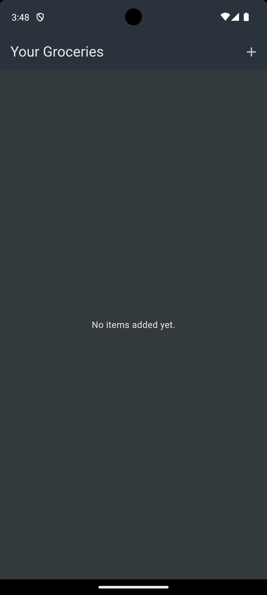
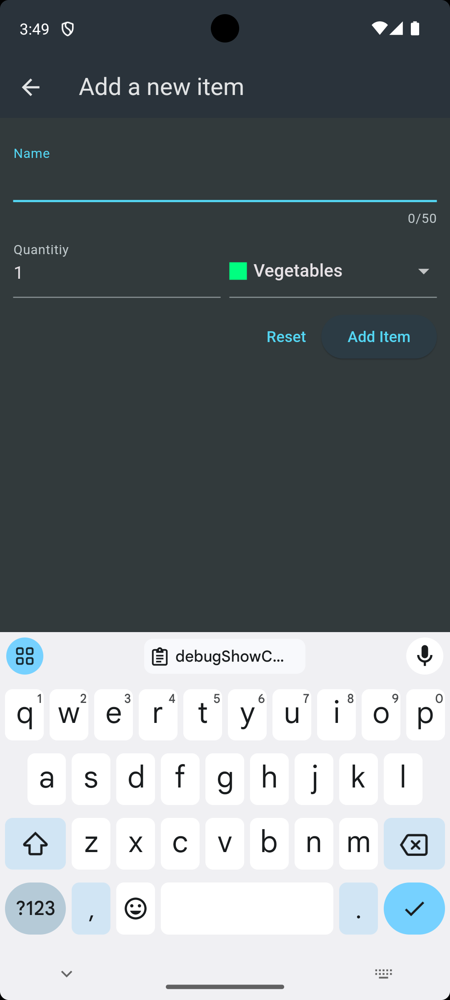
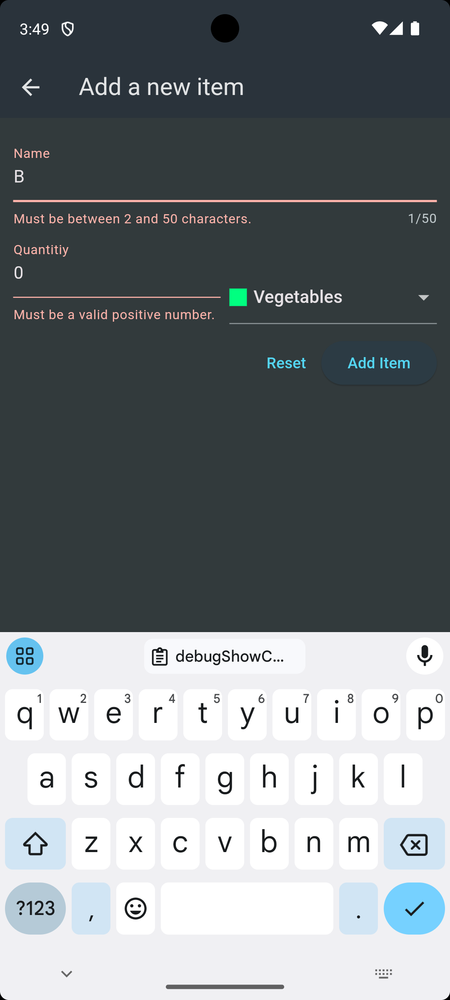
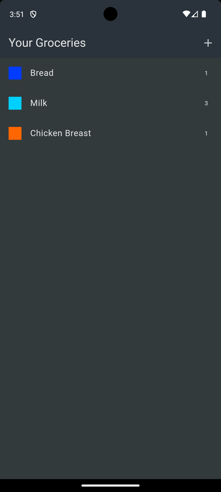

# Shopping List (FutureBuilder)

Shopping List is a Flutter app that helps you with your weekly shopping! You can add items on your screen with the fitting category, like meat or vegetable, and the ammount you need to by. This code was produced during the completion of the Flutter course [A Complete Guide to the Flutter SDK & Flutter Framework for building native iOS and Android apps](https://www.udemy.com/course/learn-flutter-dart-to-build-ios-android-apps/learn/lecture/37130436#overview).

## Basic functionality
- Displaying a list of shopping items.
- Adding new items to the list.
- Removing items from the list.
- Validating user input.
- Connecting user input with a realtime database (Firebase).

### Screenshots 

  
  
  
  

### Example walkthrough

  

## Topics covered (Branch Basic)

- Used the Form widget to be able to include more specific functionality for user inputs in forms.
- Learned about the validator function and used it to validate user input.
- Used TextFormField and DorpdownButtonFormField for more specific functionalities.
- Used a GlobalKey to keep the internal state and not rebuild the underlying widegt which was the form widget.
- Used the GlobalKey to save user input.

## Topics covered (Branch Backend)

- Learned how to set up a [realtime database with firebase](https://firebase.google.com/docs/reference/rest/database).
- Used the [HTTP package](https://pub.dev/packages/http) to make http requests to the realtime database.
- Used the as keyword to bundle a package, here http, into an object.
- Used the post method to post data to the database.
- Learned about the usage of status codes and how to handle errors with it.
- Learned about the response body provided by firebase.
- Used mounted to check if the context is still associated with the widget we are currently in.
- Used get to retrieve data.
- Learned about dynamic datatype which means that we can mix different datatypes.
- Used CircularProgressIndicator to add a loading spinner to the screens.
- Used the delete method to delete dara from my backend.
- Learned how to throw an Exception in flutter.
- Used try catch to utilize better error handling.

## Topics covered (Branch FutureBuilder)
- Learned about the future builder automatically updating the ui when the future it listens to is resolved.
- Problems with futurebuilder not working properly in this app, which is why the approach in the backend branch is preferred.